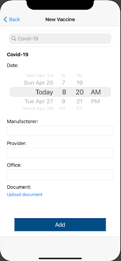
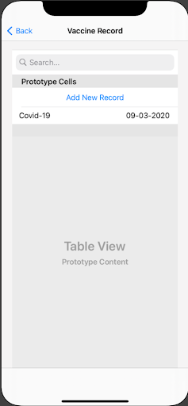

# vaxtrack
An iOS application allowing doctors and patients to keep track of their vaccination records and manage upcoming appointments. Based on the scheduled appointments, doctors can easily identify which patient is waiting for the vaccination certificate and verify it. Records would be automatically saved for users once their doctors verify them. It allows users to upload the vaccination certificate to use as official proof. Depending on the role, they would experience different user interface. 

:-------------------------:
Home (Patient)

  |    
:-------------------------:|:-------------------------:
Adding a new vaccine record     |  Vaccine record list
